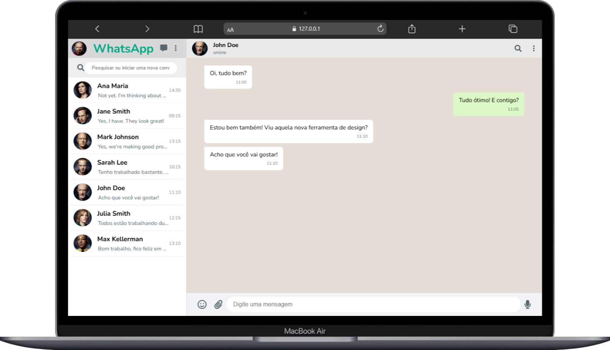

# frontend-whatsapp 

Este projeto é um clone do WhatsApp desenvolvido com frontend e backend integrados para simular o funcionamento básico do aplicativo de mensagens. A aplicação utiliza requisições GET, permitindo visualizar contatos e mensagens de forma dinâmica.

## Tecnologias
* HTML
* CSS
* JavaScript / Node.JS

## Autor
[Marcelo Vieira](<https://www.linkedin.com/in/marcelovieirasilva/>)

